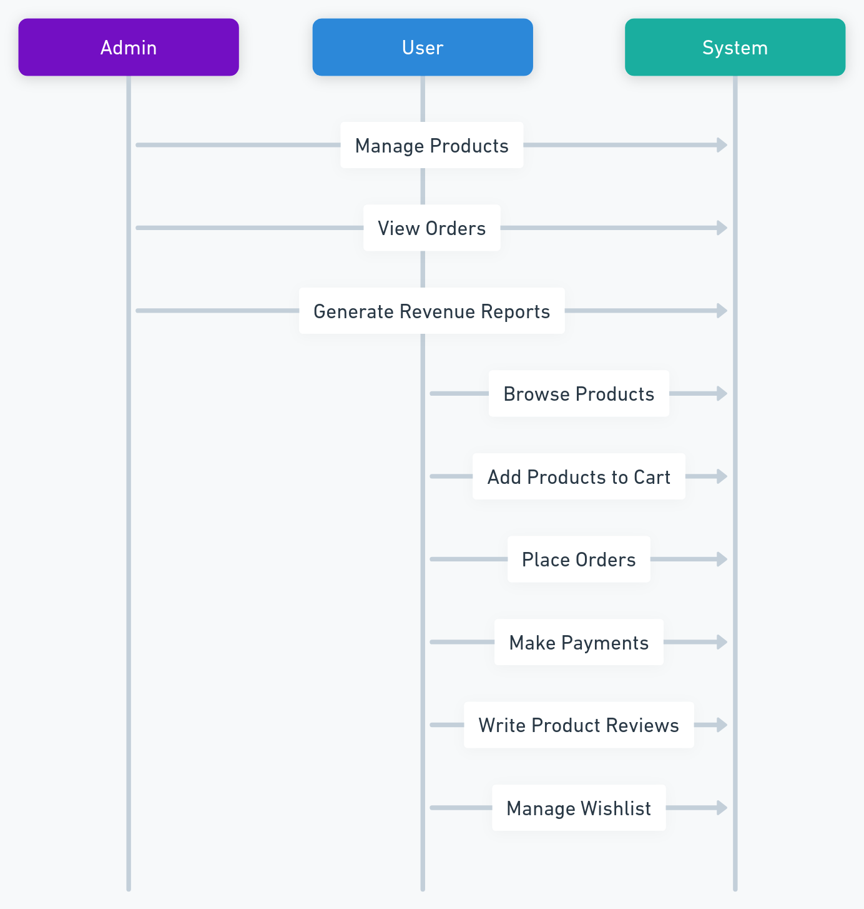
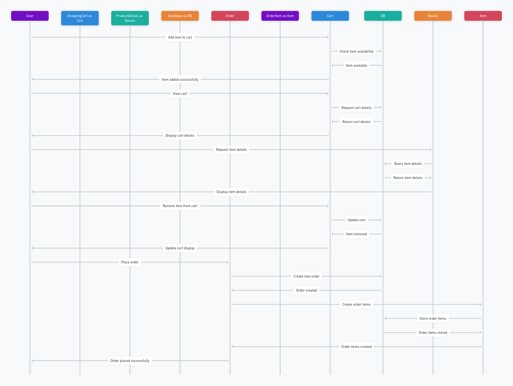

# ecommerce
## System Overview
### E-commerce System Overview (Mind Map)
#### Purpose
- The E-commerce System Overview is a mind map that outlines the main entities and their relationships within our e-commerce platform. It serves as a high-level visual representation to help team members and stakeholders understand the system's structure at a glance.
#### Diagram

#### Components
- Admin: Manages users and generates revenue reports.
- User: Engages with the system through various actions like browsing products, making orders, and writing reviews.
- Product: Central to the system, associated with categories, reviews, and included in orders and wishlists.
- Order: Represents transactions made by users, containing order items.
- Payment: Linked to orders, handling the financial transactions.

### Use Cases
#### Purpose
- The Use Cases diagram illustrates the interactions between users (both admins and customers) and the system. It highlights the key functionalities available to each type of user, providing a clear picture of how the system is used.

#### Key Use Cases
- Admin Use Cases: Include managing products, viewing orders, and generating revenue reports.
- User Use Cases: Encompass browsing products, adding products to the cart, placing orders, making payments, writing product reviews, and managing the wishlist.
###  Schema
#### User

- Attributes: UserID, Name, Email, Password
- Relationships: Places Orders, Writes ProductReviews, Has a Wishlist, Has a Cart

#### Product

- Attributes: ProductID, Name, Description, Price, CategoryID
- Relationships: Belongs to Category, Has Reviews, Can be in multiple Wishlists, Can be in multiple Carts

#### Order

- Attributes: OrderID, UserID, OrderDate, Status
- Relationships: Contains OrderItems, Associated with a Payment, Made by a User

#### OrderItem

- Attributes: OrderItemID, OrderID, ProductID, Quantity
- Relationships: Part of an Order, Related to a Product

#### Cart

- Attributes: CartID, UserID
- Relationships: Contains CartItems, Owned by a User

#### CartItem

- Attributes: CartItemID, CartID, ProductID, Quantity
- Relationships: Part of a Cart, Related to a Product

#### Category

- Attributes: CategoryID, Name, Description
- Relationships: Contains Products

#### ProductReview

- Attributes: ReviewID, ProductID, UserID, Rating, Comment
- Relationships: Written for a Product, Written by a User

#### Wishlist

- Attributes: WishlistID, UserID
- Relationships: Owned by a User, Contains Products

#### Payment

- Attributes: PaymentID, OrderID, Amount, PaymentDate, PaymentMethod
- Relationships: Associated with an Order

#### Admin

- Attributes: AdminID, Name, Email, Password
- Relationships: Manages Users, Generates Reports

#### RevenueReport

- Attributes: ReportID, Date, TotalRevenue
- Relationships: Generated by Admin

#### History

- Attributes: HistoryID, UserID, Action, Date
- Relationships: Tracks User Activity

### API Endpoints

#### User Endpoints

- `GET /api/users`: Get all users
- `GET /api/users/{id}`: Get a specific user by ID
- `POST /api/users`: Create a new user
- `PUT /api/users/{id}`: Update a user by ID
- `DELETE /api/users/{id}`: Delete a user by ID

#### Product Endpoints

- `GET /api/products`: Get all products
- `GET /api/products/{id}`: Get a specific product by ID
- `POST /api/products`: Create a new product
- `PUT /api/products/{id}`: Update a product by ID
- `DELETE /api/products/{id}`: Delete a product by ID

#### Order Endpoints

- `GET /api/orders`: Get all orders
- `GET /api/orders/{id}`: Get a specific order by ID
- `POST /api/orders`: Create a new order
- `PUT /api/orders/{id}`: Update an order by ID
- `DELETE /api/orders/{id}`: Delete an order by ID

#### Cart Endpoints

- `GET /api/carts`: Get all carts
- `GET /api/carts/{id}`: Get a specific cart by ID
- `POST /api/carts`: Create a new cart
- `PUT /api/carts/{id}`: Update a cart by ID
- `DELETE /api/carts/{id}`: Delete a cart by ID

#### Category Endpoints

- `GET /api/categories`: Get all categories
- `GET /api/categories/{id}`: Get a specific category by ID
- `POST /api/categories`: Create a new category
- `PUT /api/categories/{id}`: Update a category by ID
- `DELETE /api/categories/{id}`: Delete a category by ID

#### Review Endpoints

- `GET /api/reviews`: Get all reviews
- `GET /api/reviews/{id}`: Get a specific review by ID
- `POST /api/reviews`: Create a new review
- `PUT /api/reviews/{id}`: Update a review by ID
- `DELETE /api/reviews/{id}`: Delete a review by ID

#### Wishlist Endpoints

- `GET /api/wishlists`: Get all wishlists
- `GET /api/wishlists/{id}`: Get a specific wishlist by ID
- `POST /api/wishlists`: Create a new wishlist
- `PUT /api/wishlists/{id}`: Update a wishlist by ID
- `DELETE /api/wishlists/{id}`: Delete a wishlist by ID

#### Payment Endpoints

- `GET /api/payments`: Get all payments
- `GET /api/payments/{id}`: Get a specific payment by ID
- `POST /api/payments`: Create a new payment
- `PUT /api/payments/{id}`: Update a payment by ID
- `DELETE /api/payments/{id}`: Delete a payment by ID

#### Admin Endpoints

- `GET /api/admins`: Get all admins
- `GET /api/admins/{id}`: Get a specific admin by ID
- `POST /api/admins`: Create a new admin
- `PUT /api/admins/{id}`: Update an admin by ID
- `DELETE /api/admins/{id}`: Delete an admin by ID

#### Revenue Report Endpoints

- `GET /api/revenue-reports`: Get all revenue reports
- `GET /api/revenue-reports/{id}`: Get a specific revenue report by ID
- `POST /api/revenue-reports`: Create a new revenue report
- `PUT /api/revenue-reports/{id}`: Update a revenue report by ID
- `DELETE /api/revenue-reports/{id}`: Delete a revenue report by ID

#### History Endpoints

- `GET /api/history`: Get all history records
- `GET /api/history/{id}`: Get a specific history record by ID
- `POST /api/history`: Create a new history record
- `PUT /api/history/{id}`: Update a history record by ID
- `DELETE /api/history/{id}`: Delete a history record by ID

### Cart and Order 
